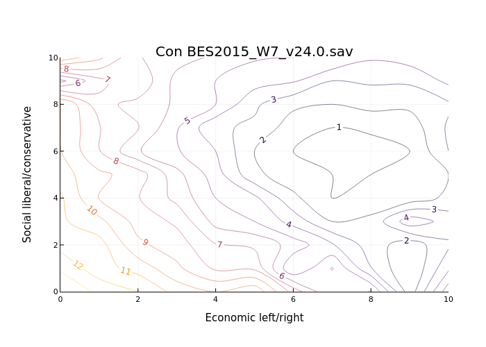
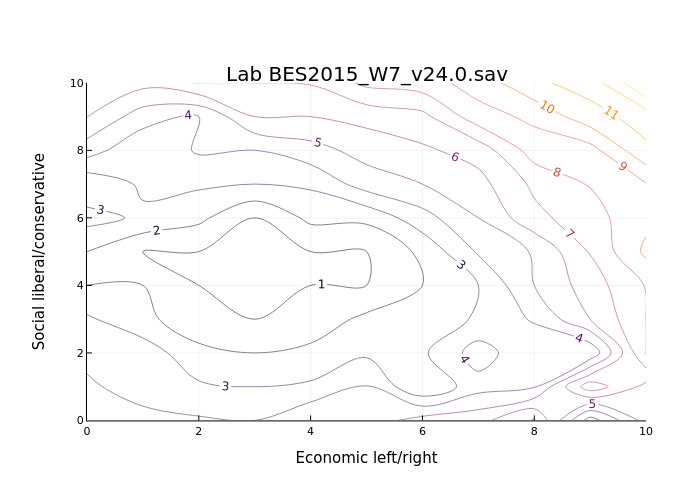

# Left/rightwingness of parties in the UK

Inspired / nicked from this Twitter thread: https://twitter.com/MariosRichards/status/1705906007610655204

Uses the British Election Study panel data - https://www.britishelectionstudy.com/data-objects/panel-study-data/

`bes.jl` plots voters' perceived distance of political parties from themselves according to their opinions on immigration and redistribution of income.

`wrangler.jl` injests the raw SPSS/SAV files and spits out a CSV for `bes.jl` to use and an arrow file. I don't recommend it, your PC will probably run out of RAM.

If you'd like the Arrow file for exploring the raw-ish BES data without a supercomputer, send me an email saying you agree to the [BES terms and conditions](https://www.britishelectionstudy.com/terms-and-conditions-of-data-use/) and I'll work out a way of getting it to you.

# Results

I think the most interesting thing to me here is that the Conservatives seem to have convinced a wider range of people that their political positions are close to their own.

BES data: Fieldhouse, E., J. Green, G. Evans, J. Mellon & C. Prosser, J. Bailey (2022) British Election Study Internet Panel Waves 1-23. DOI: 10.5255/UKDA-SN-8810-1
